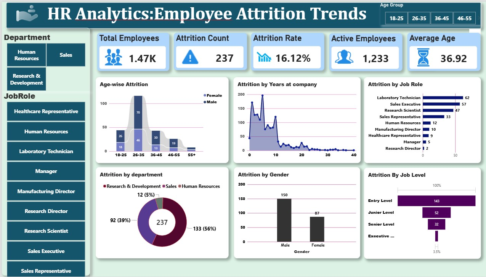

# HR Analytics: Employee Attrition Trends Dashboard

An interactive Power BI dashboard designed to uncover patterns behind workforce turnover, identify high-risk roles and demographics, and guide data-driven employee retention strategies.

---

## 📊 Dashboard Overview

---

## 📌 Key Metrics (KPIs)

* **Total Employees:** 1,470
* **Attrition Count:** 237
* **Overall Attrition Rate:** 16.12%
* **Active Workforce:** 1,233
* **Average Employee Age:** 36.92 years

---

## 🔍 Key Insights & Breakdown

* **Departmental Impact:** The highest volume of attrition occurs within **Research & Development** (56%), followed by **Sales** (39%) and **Human Resources** (5%).
* **Age Group Dynamics:** The **26–35 age band** experiences the highest turnover rate, with male attrition significantly outpacing female attrition across all age segments.
* **Role Vulnerability:** **Laboratory Technicians**, **Sales Executives**, and **Research Scientists** represent the top three roles affected by departures.
* **Experience & Tenor:** Employee turnover spikes sharply within the **first 1–3 years** at the company, stabilizing after year 5.
* **Job Hierarchy:** Turnover is heavily concentrated at the **Entry Level** and decreases progressively up through executive-level tiers.

---

## 🛠️ Tech Stack & Tools

* **Business Intelligence:** Microsoft Power BI (DAX, Power Query)
* **Data Modeling:** Star Schema / Fact & Dimension Relationships
* **Visualizations:** Donut Charts, Stacked Bar Charts, Area Charts, Funnel Charts, Slicers

---

## 💡 Strategic Recommendations

1. **Onboarding & Early Retention:** Implement robust 30-60-90 day check-in milestones to address early tenure drop-offs (years 1–3).
2. **Career Progression for Entry Roles:** Create transparent development pathways for laboratory and sales talent to mitigate early-career burnout.
3. **Targeted Department Initiatives:** Conduct detailed exit interviews within R&D and Sales to pinpoint workload and compensation discrepancies.
4.
